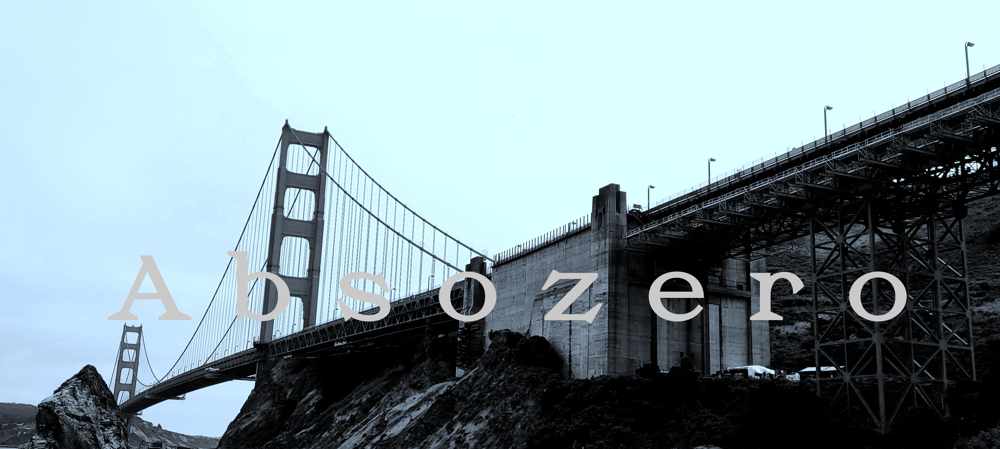


# I'm Aswath (absozero), hello! 👋

I enjoy programming and the idea of being able to solve difficult problems and getting through difficulty to make breakthroughs.

I work in hardware, more specifically in the VEX ecosystem. I program and help build the robot after the design process.

I firmly believe that many problems can be both created and solved by technology, and it is up to us, as developers, to choose which side to pursue.

---

### My stack:

---

